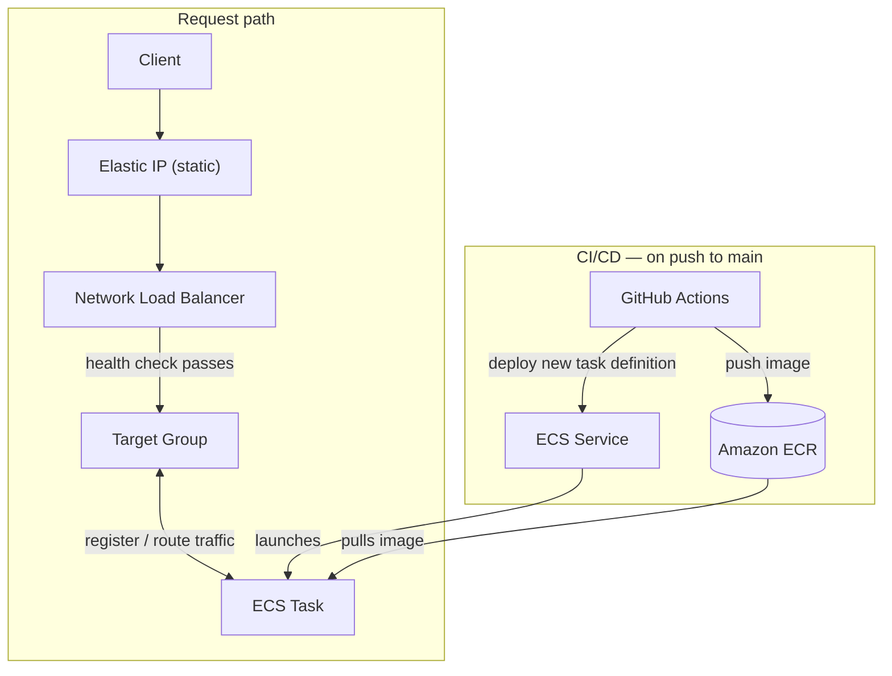

# Poly-vault

A multimodal RAG service that ingests documents, chunks them by meaning, stores them in a vector database, and answers questions grounded strictly in the retrieved context.


**Board link:** https://miro.com/app/board/uXjVH8rkfWQ=/?share_link_id=285379039612

**Live:** http://3.213.56.253/

## Architecture



Every push to `main` builds a new image, pushes it to ECR, and rolls a new ECS task out behind the target group. Clients always hit the same Elastic IP — the NLB only starts routing to a new task once it passes its health check, so the container churn underneath is invisible to callers.

## How it works

### Document ingestion

1. Parse documents (PDF, DOCX, images, CSV, XLSX, Markdown) into Markdown using Docling.
2. Split the text into sentences with BlingFire.
3. Group related sentences into semantic chunks.
4. Generate embeddings and store them in ChromaDB.
5. Track each document's progress (staging → embedding → indexed / failed) in SQLite.

### Query flow

1. Embed the user's question.
2. Retrieve the most relevant chunks from ChromaDB.
3. Rerank the results using Cohere.
4. Generate an answer with Gemini using only the retrieved context.

## Features

- Supports PDF, DOCX, images, CSV, XLSX, and Markdown
- Semantic chunking for better retrieval quality
- Two-stage retrieval with reranking
- Context-grounded answers
- Background document processing
- Persistent ChromaDB storage
- Document status tracking in SQLite
- Minimal web UI for upload, listing, deletion, and querying
- Automated build & deploy to AWS on every push to `main`

## Stack

FastAPI · Docling · BlingFire · ChromaDB · MiniLM embeddings · Cohere reranker · Gemini · SQLAlchemy/SQLite · GitHub Actions · Amazon ECR/ECS · NLB

## Project Structure

```text
poly-vault/
├── .github/workflows/
│   └── aws-ecs-deploy.yml      # Build, push to ECR, deploy to ECS
├── rag_system/
│   ├── document_processor.py   # Parse → split → chunk → store
│   ├── retriever.py            # ChromaDB store, query, rerank
│   ├── generator.py            # Gemini service + RAG prompt
│   ├── model.py                # Pipeline table + repository
│   └── utils.py                # Logger, schemas, status enum
├── app/
│   ├── main.py                 # FastAPI app + routers
│   ├── api.py                  # File + query routes
│   ├── dependencies.py         # Singleton wiring, DB session
│   └── static/                 # index.html, style.css, js/script.js
├── pipeline/{staging,processed}/
├── chromadb/                   # Vector store
├── pipeline.db                 # Document metadata store
├── docs/rag-architecture.jpg
├── Dockerfile
└── .env
```

## Setup

Create a virtual environment and install dependencies:

```bash
python -m venv .venv
source .venv/bin/activate
pip install -r requirements.txt
```

Create a `.env` file:

```env
COHERE_API_KEY=your_key
GEMINI_API_KEY=your_key
```

Run the application:

```bash
polyvault-rag/src/app:~ fastapi run main.py | uvicorn app.main:app --reload
```

Or with Docker:

```bash
docker build -t poly-vault .
docker run -p 8000:8000 --env-file .env poly-vault
```

Open the UI at `http://127.0.0.1:8000/` and the API docs at:

```
http://127.0.0.1:8000/docs
```

## CI/CD & Deployment

Every push to `main` triggers a GitHub Actions workflow (`.github/workflows/aws-ecs-deploy.yml`) that ships the image straight to AWS:

1. **Build** — Docker Buildx builds the image from the repo `Dockerfile` and tags it with the commit SHA.
2. **Push** — the image is logged in and pushed to Amazon ECR (`ligo/poly-vault`).
3. **Render task definition** — the current ECS task definition (`ligo-rag-task`) is pulled, stripped of read-only fields (ARN, revision, status, etc.), and re-rendered with the new image for the `Main` container.
4. **Deploy** — the updated task definition is registered and rolled out to the ECS service (`ligo-rag-service`) on cluster `ligo-cluster-1`; the workflow waits for the service to stabilize before finishing.

See [Architecture](#architecture) above for how the NLB and Elastic IP keep the public address stable across deploys.

## API

| Method | Endpoint                  | Description               |
| ------ | ------------------------- | ------------------------- |
| POST   | `/rag/files/import`       | Upload a document         |
| GET    | `/rag/files/`             | List documents            |
| DELETE | `/rag/files/?doc_id=...`  | Delete a document         |
| GET    | `/query/search?query=...` | Ask a question            |
| POST   | `/query/retrieve`         | Retrieve relevant chunks  |
| DELETE | `/query/reset-vector`     | Clear the vector database |

## Example

Upload a document:

```bash
curl -X POST http://127.0.0.1:8000/rag/files/import \
  -F "file=@document.pdf"
```

Ask a question:

```bash
curl "http://127.0.0.1:8000/query/search?query=What is the refund policy?"
```

## Notes

- Models can be changed in `dependencies.py`.
- The MiniLM tokenizer is fetched on first run (`local_files_only=False`); set it to `True` in `retriever.py` to run fully offline.
- Deleting a document removes both its database row and its vectors.
- `reset-vector` permanently clears the stored embeddings and the document table.
- No auth is enforced on the API yet — the delete and reset-vector endpoints are callable by anyone who can reach the address.
